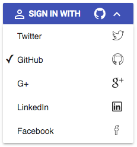

# Menu Buttom

A WAI-ARIA friendly menu button.

>**Note:** Documentation is not completed. 

## Introduction
A menu button is a [button](https://www.w3.org/TR/wai-aria-practices/#button) that opens a 
[menu](https://www.w3.org/TR/wai-aria-practices/#menu). It is often styled as a typical push button with a 
downward pointing arrow or triangle to hint that activating the button will display a menu. 
The menu button has roles, attributes and behaviour as outlined in WAI-ARIA Authoring Practices.

## Characteristics

### Keyboard interaction, Menu Button 
* With focus on the button:
    * <kbd>Space</kbd> or <kbd>Enter</kbd>: opens the menu and place focus on the previously selected menu item - or on the first menu item if no selected menu item.
    * <kbd>Down Arrow</kbd>: opens the menu and moves focus to the first menu item.
    * <kbd>Up Arrow</kbd>: opens the menu and moves focus to the last menu item.

### Mouse interaction, Menu Button 
* With focus on the button:
    * <kbd>Click</kbd>: opens the menu and place focus on the previously selected menu item - or on the first menu item if no selected menu item.
    
### Keyboard interaction, Menu
* With focus on the menu:
    * <kbd>Space</kbd> or <kbd>Enter</kbd>: sets `aria-selected="true"` on active menu item, closes menu and moves focus back to menu button. The button emits a custom `select` event with a referfence to the selected menu element.
    * <kbd>Home</kbd>: move focus to first menu item.
    * <kbd>End</kbd>: move focus to last menu item.
    * <kbd>Up Arrow</kbd> or <kbd>Left Arrow</kbd>: move focus to previous menu item.
    * <kbd>Down Arrow</kbd> or <kbd>Right Arrow</kbd>: Move focus to next menu item.
    * <kbd>Esc</kbd>: Close menu and move focus back to menu button.

>The keyboard behaviors after the menu is open are described in more detail in WAI-ARIA Authoring Practices, [2.19 Menu or Menu bar](https://www.w3.org/TR/wai-aria-practices/#menu).

### Mouse interaction, Menu
* With focus on the menu:
    * <kbd>Click</kbd>: sets `aria-selected="true"` on active menu item, closes menu and moves focus back to menu button. The button emits a custom `select` event with a referfence to the selected menu element. 

### Menu Button, WAI-ARIA Roles, States, and Properties
* `role="button"`: the element that opens the menu has role [button](http://www.w3.org/TR/wai-aria-1.1/#button).
* `aria-haspopup`: the element with role `button` has [aria-haspopup](http://www.w3.org/TR/wai-aria-1.1/#aria-haspopup) set to `true`.
* `aria-controls`: identfies the content on the page (e.g. using IDREFs) that this menu button controls.
* `aria-expanded`: the element with role `button` has [aria-expanded](https://www.w3.org/TR/wai-aria-1.1/#aria-expanded) set to `true` if the corresponding menu is open, oterwise false.
* `tabindex`:

### Menu, WAI-ARIA Roles, States, and Properties
* `role="menu"`: identifies the element as a menu widget.
* `role="menuitem"`: identifies an element as a menu item widget.
* `aria-labelledby`: use to provide a label for the menu widget.
* `aria-selected`: identifies the selected menu item.
* `tabindex`:
 
>The roles, states, and properties needed for the menu are described in more detail in WAI-ARIA Authoring Practices, [2.19 Menu or Menu bar](https://www.w3.org/TR/wai-aria-practices/#menu).

## To include a MDLEXT **menu button** component:
TBD

### Example
TBD

### More examples
* The [snippets/menu-button.html](./snippets/menu-button.html) and the [tests](../../test/menu-button/menu-button.spec.js) provides more detailed examples.
* Try out the [live demo](http://leifoolsen.github.io/mdl-ext/demo/menu-button.html)
